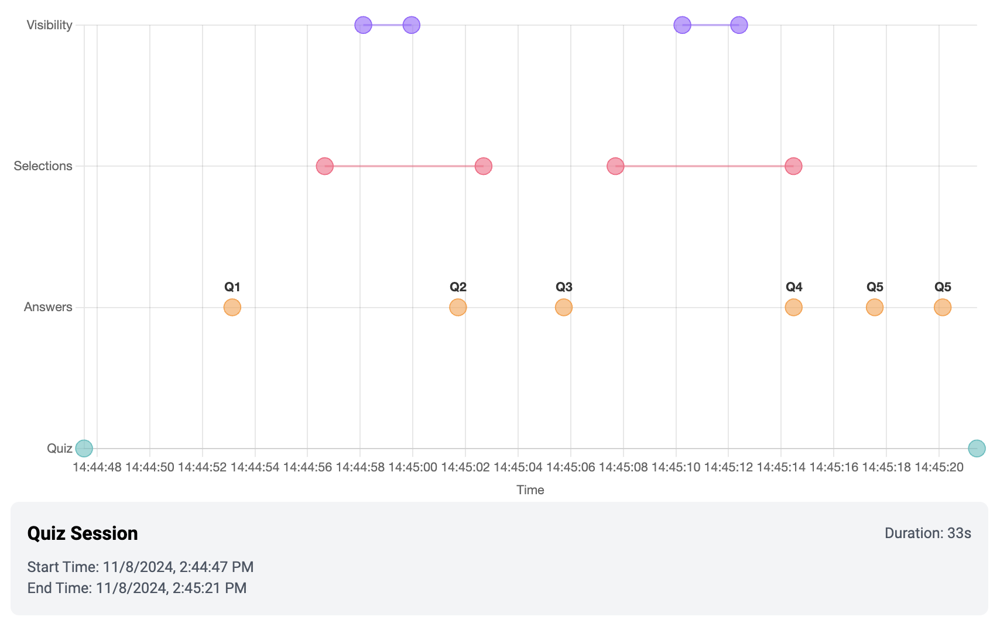
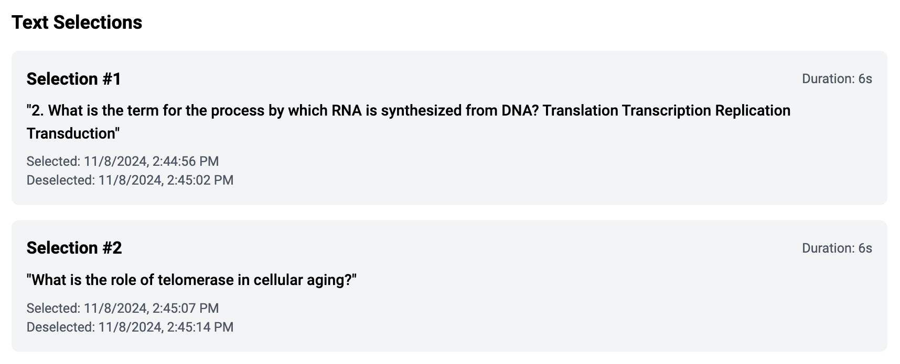

# Quizlytics

Quizlytics is a quiz application designed to detect potential cheating behavior during online assessments. It combines a standard quiz interface with advanced analytics tracking to monitor student behavior during test-taking.

## Features




### Quiz Taking

-   Multiple-choice biology questions
-   Real-time answer submission
-   Immediate feedback after quiz completion

### Analytics Tracking

-   **Timeline Visualization**: Interactive chart showing:
    -   Quiz start/end times
    -   Answer submission timestamps
    -   Text selection events
    -   Tab visibility changes (when students leave/return to the quiz)
-   **Text Selection Monitoring**

    -   Tracks when text is selected/copied
    -   Records the specific text that was selected
    -   Measures duration of selections

-   **Tab Visibility**
    -   Detects when students switch away from the quiz tab
    -   Records duration of absence from the quiz

### Detailed Analytics Review

-   Complete session duration tracking
-   Comprehensive timeline of all quiz interactions

## Getting Started

### Prerequisites

-   Node.js (v14 or higher)
-   Python 3.8+
-   pip

### Installation

1. Clone the repository:

```bash
git clone https://github.com/majorschwartz/quizlytics.git
```

2. Install frontend dependencies:

```bash
cd client
npm install
```

3. Install backend dependencies:

```bash
cd server
pip install -r requirements.txt
```

4. Create a `.env` file in the server directory:

```
ORIGIN_ENDPOINT=http://localhost:3000
```

### Running the Application

1. Start the frontend:

```bash
cd client
npm start
```

2. Start the backend:

```bash
cd server
uvicorn app:app --reload
```

The application will be available at `http://localhost:3000`
